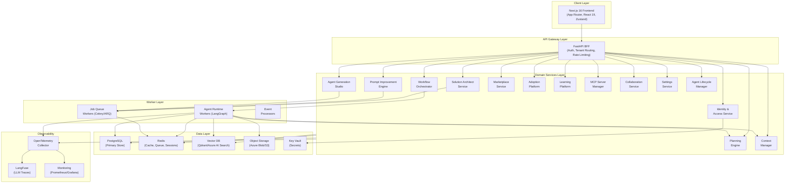
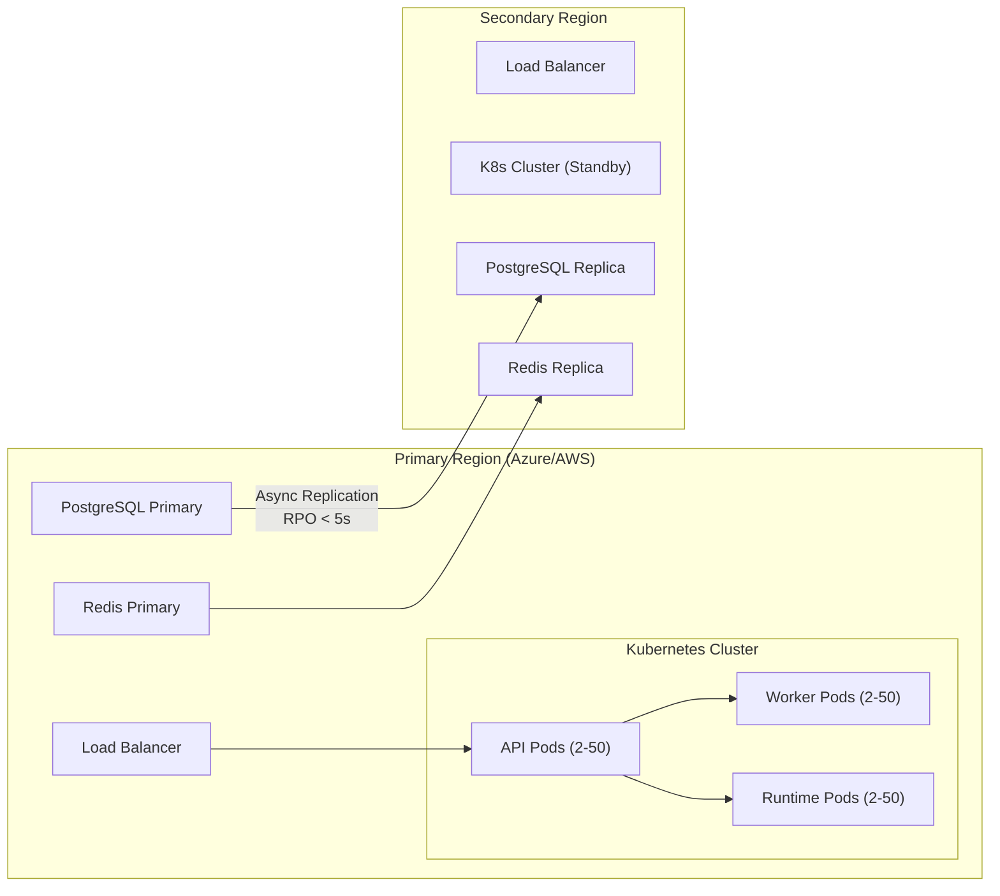
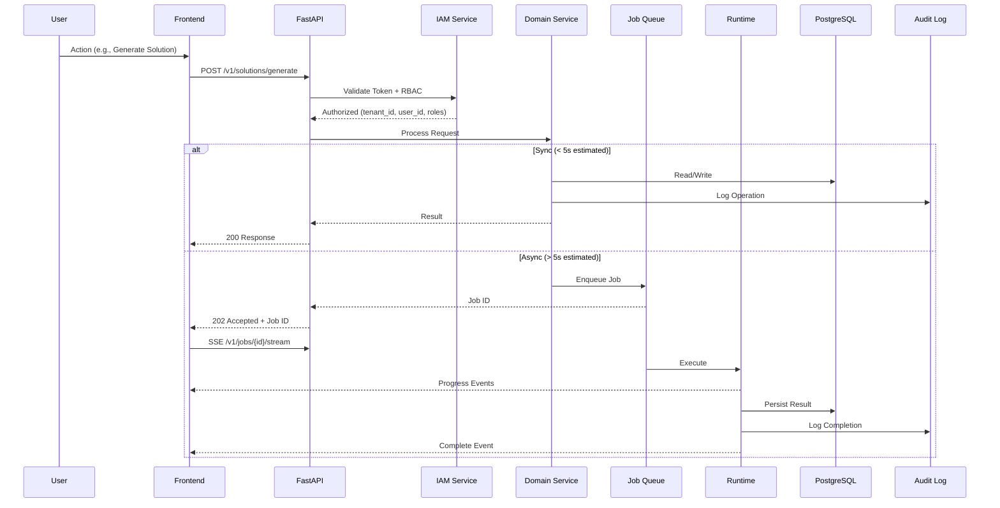
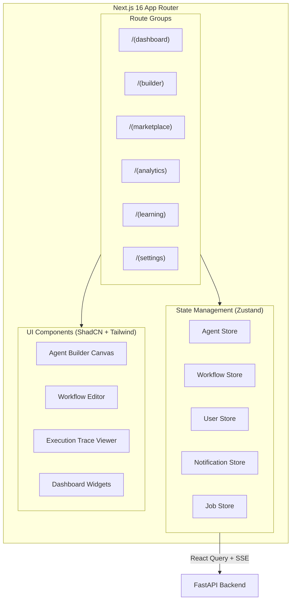
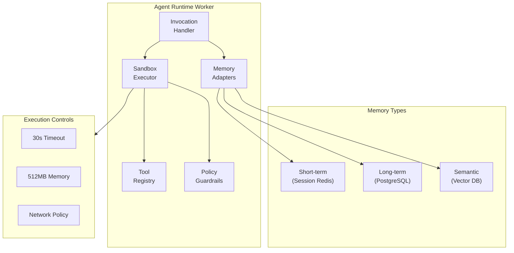
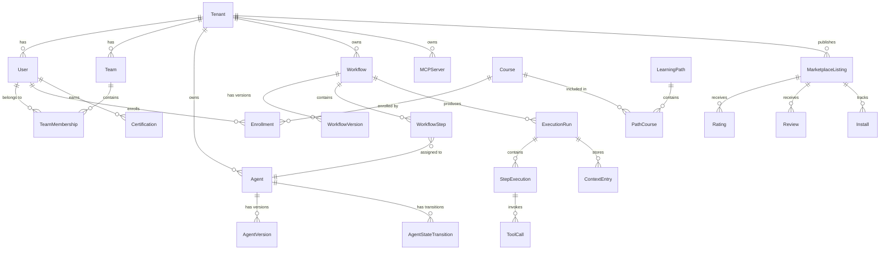

# Design Document: AgentThat Platform

## Overview

AgentThat is an enterprise AI adoption operating system enabling non-technical employees to create, deploy, share, orchestrate, govern, monitor, optimize, and improve AI agents and multi-agent workflows without writing code. The platform serves four primary personas: Employee Builders, Team Leads, Platform Admins, and Executives across thousands of organizations with millions of users.

The system is architected as a multi-tenant, cloud-native platform with a Next.js 16 frontend communicating through a FastAPI backend that orchestrates agent execution via LangGraph/PydanticAI runtime workers. The architecture prioritizes tenant isolation, horizontal scalability, zero-downtime deployments, and comprehensive observability.

### Key Design Decisions

1. **Service-oriented monolith with domain boundaries** — Start as a modular FastAPI application with clear domain boundaries that can be extracted into microservices as scale demands. This avoids premature distributed systems complexity while maintaining clean separation.
2. **Event-driven async processing** — All long-running operations (agent generation, workflow execution, optimization analysis) route through a Redis-backed job queue with SSE/WebSocket streaming for real-time progress.
3. **LangGraph for orchestration** — LangGraph provides the stateful graph execution model needed for multi-agent workflows with checkpointing, human-in-the-loop, and dynamic routing.
4. **Tenant-scoped data access layer** — Every database query passes through a tenant-aware repository layer that injects tenant isolation at the ORM level, making cross-tenant data leakage structurally impossible.
5. **Immutable audit trail** — All state mutations produce append-only audit events, enabling compliance and debugging without impacting write performance.

## Architecture

### High-Level System Architecture



### Deployment Architecture



### Request Flow



## Components and Interfaces

### API Layer (FastAPI BFF)

The API layer serves as the Backend-for-Frontend, handling authentication, tenant routing, request validation, and API composition.

**Base URL:** `/v1`

**Authentication:** Bearer token (JWT) with tenant context extracted from token claims.

#### Core API Groups

| Group | Prefix | Description |
|-------|--------|-------------|
| Health | `/v1/health` | Liveness and readiness probes |
| Solution Architect | `/v1/solutions` | Generate, list, deploy solutions |
| Prompt Engine | `/v1/prompts` | Improve, version, compare prompts |
| Agents | `/v1/agents` | CRUD, lifecycle, execution |
| Workflows | `/v1/workflows` | CRUD, lifecycle, control, execution |
| Orchestration | `/v1/orchestration` | Execution runs, traces, step control |
| Marketplace | `/v1/marketplace` | Browse, publish, install, rate |
| Analytics | `/v1/analytics` | Metrics, reports, exports |
| Learning | `/v1/learning` | Courses, paths, certifications |
| Teams | `/v1/teams` | Members, roles, collaboration |
| Settings | `/v1/settings` | Profile, notifications, integrations |
| MCP Servers | `/v1/mcp-servers` | Create, validate, version, connect |
| Jobs | `/v1/jobs` | Background job status and streaming |
| Audit | `/v1/audit` | Log search and export |

#### Key API Endpoints

```python
# Solution Architect
POST   /v1/solutions/generate          # Generate solution from requirement
GET    /v1/solutions                    # List generated solutions
POST   /v1/solutions/{id}/deploy       # Deploy a solution
DELETE /v1/solutions/{id}              # Delete a solution

# Prompt Improvement
POST   /v1/prompts/improve             # Improve a prompt
POST   /v1/prompts/alternatives        # Generate alternative versions
GET    /v1/prompts/{id}/versions       # Get version history
POST   /v1/prompts/{id}/accept         # Accept improvements selectively

# Agent CRUD & Lifecycle
POST   /v1/agents                      # Create agent (manual mode)
GET    /v1/agents                      # List agents (filtered)
GET    /v1/agents/{id}                 # Get agent detail
PUT    /v1/agents/{id}                 # Update agent
POST   /v1/agents/{id}/transition      # Lifecycle state transition
POST   /v1/agents/{id}/execute         # Execute agent
GET    /v1/agents/{id}/versions        # Version history

# Agent Generation (AI Mode)
POST   /v1/agents/generate             # AI-generate agent config
POST   /v1/agents/{id}/optimize        # Optimization mode

# Workflow CRUD & Control
POST   /v1/workflows                   # Create workflow
GET    /v1/workflows                   # List workflows
GET    /v1/workflows/{id}              # Get workflow detail
PUT    /v1/workflows/{id}              # Update workflow
POST   /v1/workflows/{id}/control      # Run/Pause/Resume
POST   /v1/workflows/{id}/optimize     # Optimize workflow
GET    /v1/workflows/{id}/versions     # Version history

# Orchestration & Execution
GET    /v1/executions                  # List execution runs
GET    /v1/executions/{id}             # Get execution detail + trace
POST   /v1/executions/{id}/approve     # Human approval for step
GET    /v1/executions/{id}/stream      # SSE stream for execution

# Marketplace
GET    /v1/marketplace                 # Browse/search listings
POST   /v1/marketplace                 # Publish listing
GET    /v1/marketplace/{id}            # Get listing detail
POST   /v1/marketplace/{id}/install    # Install item
POST   /v1/marketplace/{id}/clone      # Clone item
POST   /v1/marketplace/{id}/fork       # Fork item
POST   /v1/marketplace/{id}/rate       # Rate item
POST   /v1/marketplace/{id}/review     # Review item

# Background Jobs
GET    /v1/jobs/{id}                   # Get job status
GET    /v1/jobs/{id}/stream            # SSE stream for job progress
POST   /v1/jobs/{id}/cancel            # Cancel job

# MCP Servers
POST   /v1/mcp-servers                 # Create MCP server
GET    /v1/mcp-servers                 # List MCP servers
POST   /v1/mcp-servers/{id}/activate   # Validate and activate
POST   /v1/mcp-servers/{id}/rollback   # Rollback to version
GET    /v1/mcp-servers/{id}/versions   # Version history
```

### Domain Services

#### 1. Solution Architect Service

Transforms natural language business requirements into complete workflow architectures.

```python
class SolutionArchitectService:
    async def generate(self, requirement: str, mode: str, 
                       tenant_id: str, user_id: str) -> GeneratedSolution:
        """
        Generates a complete solution architecture.
        Routes to LLM provider or falls back to rule-based heuristics.
        For payloads > 4000 chars, automatically enqueues as background job.
        """
        
    async def validate_requirement(self, requirement: str) -> ValidationResult:
        """
        Validates input length (20-8000 chars) and business intent 
        (minimum 2 domain-relevant terms).
        """
        
    def fallback_generate(self, requirement: str) -> GeneratedSolution:
        """
        Rule-based fallback when LLM is unavailable.
        Produces valid solution meeting structural requirements.
        """
```

#### 2. Workflow Orchestrator Service

Coordinates multi-agent execution using LangGraph state machines.

```python
class WorkflowOrchestrator:
    async def execute(self, workflow_id: str, input_data: dict,
                      tenant_id: str) -> ExecutionRun:
        """
        Initiates workflow execution with full state machine.
        Supports: sequential, parallel, routing, human-in-loop, retry.
        """
        
    async def checkpoint(self, execution_id: str) -> None:
        """
        Persists execution state for long-running workflows.
        Called at step completion and every 60s during long steps.
        """
        
    async def resume(self, execution_id: str) -> ExecutionRun:
        """
        Resumes from most recent checkpoint after failure.
        Re-executes partially completed step from beginning.
        """

    async def delegate(self, source_agent: str, target_agent: str,
                       subtask: str, context: dict) -> DelegationResult:
        """
        Handles agent-to-agent delegation within a workflow.
        Validates target agent eligibility before delegation.
        """
```

#### 3. Context Manager Service

Manages context passing between agents in multi-agent workflows.

```python
class ContextManager:
    async def pass_context(self, source_agent_id: str, target_agent_ids: list[str],
                           output: AgentOutput, workflow_id: str) -> ContextPackage:
        """
        Creates structured context from agent output.
        Applies summarization if context exceeds window limit.
        """
        
    async def merge_parallel(self, outputs: list[AgentOutput],
                             downstream_task: str) -> ContextPackage:
        """
        Merges parallel agent outputs ordered by relevance.
        Preserves source identity for each contribution.
        """
        
    async def read_shared_store(self, workflow_execution_id: str,
                                requesting_agent_id: str,
                                tenant_id: str) -> list[ContextEntry]:
        """
        Reads from shared context store with tenant isolation.
        Denies cross-tenant access.
        """
        
    def summarize(self, context: str, max_tokens: int) -> str:
        """
        Applies progressive summarization to fit context window.
        Preserves key facts, decisions, and data points.
        """
```

#### 4. Planning Engine Service

Enables agents to decompose complex tasks into multi-step plans.

```python
class PlanningEngine:
    async def create_plan(self, task: str, available_tools: list[str],
                          agent_id: str) -> Plan:
        """
        Decomposes task into 2-20 steps with goals, tools, 
        expected outputs, and dependencies.
        """
        
    async def evaluate_step(self, step_output: Any, 
                            expected_criteria: dict,
                            threshold: float = 0.7) -> StepEvaluation:
        """
        Evaluates step output against expected criteria.
        Returns deviation score and whether re-planning is needed.
        """
        
    async def replan(self, plan: Plan, failed_step: int,
                     failure_reason: str) -> Plan:
        """
        Generates alternative plan avoiding failed strategies.
        Preserves completed step results.
        """
```

#### 5. Agent Lifecycle Manager

Manages agent state transitions with validation and governance.

```python
class AgentLifecycleManager:
    VALID_TRANSITIONS = {
        "draft": ["testing", "retired"],
        "testing": ["staging", "retired"],
        "staging": ["production", "retired"],
        "production": ["deprecated", "retired"],
        "deprecated": ["retired"],
        "retired": [],
    }
    
    async def transition(self, agent_id: str, target_state: str,
                         actor_id: str, tenant_id: str) -> AgentStateTransition:
        """
        Validates and executes lifecycle state transition.
        Enforces prerequisites (e.g., recent test for production).
        """
        
    def validate_transition(self, current_state: str, 
                            target_state: str) -> bool:
        """
        Checks if transition is valid per state machine rules.
        """
```

### Frontend Architecture



**Key Frontend Patterns:**

- **Server Components** for initial data fetch and SEO-relevant pages
- **Client Components** for interactive builders, real-time updates, and forms
- **Zustand stores** for cross-component state (agents, workflows, jobs, user)
- **React Query** for server state management with cache invalidation
- **SSE hooks** for real-time job progress and execution streaming
- **ShadCN UI** for consistent, accessible component library
- **Framer Motion** for smooth canvas interactions and transitions

### Agent Runtime Architecture



**Runtime Isolation:**
- Each agent invocation gets a dedicated memory space
- Tool execution sandboxed with resource limits (30s timeout, 512MB RAM)
- Network access restricted to policy-permitted destinations
- Token usage and cost tracked per invocation

## Data Models

### Core Entity Relationship



### Primary Data Models

```python
# === Tenant & Identity ===

class Tenant(Base):
    __tablename__ = "tenants"
    id: Mapped[uuid] = mapped_column(primary_key=True)
    name: Mapped[str] = mapped_column(String(200))
    tier: Mapped[str] = mapped_column(String(20))  # free, pro, enterprise
    data_region: Mapped[str] = mapped_column(String(50))
    max_concurrent_jobs: Mapped[int] = mapped_column(default=5)
    hourly_cost_rate: Mapped[Decimal] = mapped_column(Numeric(10, 2))
    currency: Mapped[str] = mapped_column(String(3), default="USD")
    audit_retention_days: Mapped[int] = mapped_column(default=365)
    created_at: Mapped[datetime] = mapped_column(server_default=func.now())

class User(Base):
    __tablename__ = "users"
    id: Mapped[uuid] = mapped_column(primary_key=True)
    tenant_id: Mapped[uuid] = mapped_column(ForeignKey("tenants.id"), index=True)
    external_id: Mapped[str] = mapped_column(String(255), unique=True)  # IdP subject
    email: Mapped[str] = mapped_column(String(240))
    display_name: Mapped[str] = mapped_column(String(120))
    role: Mapped[str] = mapped_column(String(20))  # Admin, Developer, User
    status: Mapped[str] = mapped_column(String(20))  # active, invited, disabled
    group_memberships: Mapped[list] = mapped_column(JSONB, default=list)
    last_login_at: Mapped[datetime | None]
    created_at: Mapped[datetime] = mapped_column(server_default=func.now())

# === Agent & Lifecycle ===

class Agent(Base):
    __tablename__ = "agents"
    id: Mapped[uuid] = mapped_column(primary_key=True)
    tenant_id: Mapped[uuid] = mapped_column(ForeignKey("tenants.id"), index=True)
    name: Mapped[str] = mapped_column(String(120))
    description: Mapped[str] = mapped_column(String(1000))
    category: Mapped[str] = mapped_column(String(80))
    lifecycle_state: Mapped[str] = mapped_column(String(20), default="draft")
    # draft | testing | staging | production | deprecated | retired
    deprecation_message: Mapped[str | None] = mapped_column(String(500))
    replacement_agent_id: Mapped[uuid | None]
    usage_count: Mapped[int] = mapped_column(default=0)
    current_version_id: Mapped[uuid | None]
    created_by: Mapped[uuid] = mapped_column(ForeignKey("users.id"))
    created_at: Mapped[datetime] = mapped_column(server_default=func.now())
    updated_at: Mapped[datetime] = mapped_column(onupdate=func.now())

class AgentVersion(Base):
    __tablename__ = "agent_versions"
    id: Mapped[uuid] = mapped_column(primary_key=True)
    agent_id: Mapped[uuid] = mapped_column(ForeignKey("agents.id"), index=True)
    tenant_id: Mapped[uuid] = mapped_column(index=True)
    version_number: Mapped[int]
    config: Mapped[dict] = mapped_column(JSONB)  # Full agent configuration
    # config includes: system_prompt, tools, memory_config, handoff_rules,
    # rag_config, governance_defaults
    created_by: Mapped[uuid] = mapped_column(ForeignKey("users.id"))
    created_at: Mapped[datetime] = mapped_column(server_default=func.now())

class AgentStateTransition(Base):
    __tablename__ = "agent_state_transitions"
    id: Mapped[uuid] = mapped_column(primary_key=True)
    agent_id: Mapped[uuid] = mapped_column(ForeignKey("agents.id"), index=True)
    tenant_id: Mapped[uuid] = mapped_column(index=True)
    from_state: Mapped[str] = mapped_column(String(20))
    to_state: Mapped[str] = mapped_column(String(20))
    actor_id: Mapped[uuid] = mapped_column(ForeignKey("users.id"))
    reason: Mapped[str | None] = mapped_column(String(500))
    transitioned_at: Mapped[datetime] = mapped_column(server_default=func.now())

# === Workflow & Orchestration ===

class Workflow(Base):
    __tablename__ = "workflows"
    id: Mapped[uuid] = mapped_column(primary_key=True)
    tenant_id: Mapped[uuid] = mapped_column(ForeignKey("tenants.id"), index=True)
    name: Mapped[str] = mapped_column(String(120))
    description: Mapped[str] = mapped_column(String(1000))
    status: Mapped[str] = mapped_column(String(20), default="draft")
    # draft | testing | active | paused | failed | completed
    agent_count: Mapped[int] = mapped_column(default=0)
    current_version_id: Mapped[uuid | None]
    last_run_at: Mapped[datetime | None]
    created_by: Mapped[uuid] = mapped_column(ForeignKey("users.id"))
    created_at: Mapped[datetime] = mapped_column(server_default=func.now())

class WorkflowVersion(Base):
    __tablename__ = "workflow_versions"
    id: Mapped[uuid] = mapped_column(primary_key=True)
    workflow_id: Mapped[uuid] = mapped_column(ForeignKey("workflows.id"), index=True)
    tenant_id: Mapped[uuid] = mapped_column(index=True)
    version_number: Mapped[int]
    config: Mapped[dict] = mapped_column(JSONB)
    # config includes: steps[], routing_map, retry_config, 
    # timeout_config, governance_policies
    created_by: Mapped[uuid] = mapped_column(ForeignKey("users.id"))
    created_at: Mapped[datetime] = mapped_column(server_default=func.now())

class WorkflowStep(Base):
    __tablename__ = "workflow_steps"
    id: Mapped[uuid] = mapped_column(primary_key=True)
    workflow_version_id: Mapped[uuid] = mapped_column(ForeignKey("workflow_versions.id"))
    tenant_id: Mapped[uuid] = mapped_column(index=True)
    step_order: Mapped[int]
    name: Mapped[str] = mapped_column(String(200))
    agent_id: Mapped[uuid | None] = mapped_column(ForeignKey("agents.id"))
    execution_type: Mapped[str] = mapped_column(String(20))
    # sequential | parallel | routing | human_approval | scheduled
    config: Mapped[dict] = mapped_column(JSONB)
    # config includes: routing_map, retry_count, backoff_strategy,
    # timeout, approval_config, schedule_config, dependencies[]

# === Execution & Tracing ===

class ExecutionRun(Base):
    __tablename__ = "execution_runs"
    id: Mapped[uuid] = mapped_column(primary_key=True)
    tenant_id: Mapped[uuid] = mapped_column(index=True)
    workflow_id: Mapped[uuid] = mapped_column(ForeignKey("workflows.id"))
    status: Mapped[str] = mapped_column(String(20))
    # running | paused | waiting_approval | waiting_schedule | completed | failed | timed_out
    current_step_index: Mapped[int] = mapped_column(default=0)
    total_steps: Mapped[int]
    checkpoint: Mapped[dict | None] = mapped_column(JSONB)
    input_data: Mapped[dict] = mapped_column(JSONB)
    output_data: Mapped[dict | None] = mapped_column(JSONB)
    total_tokens_in: Mapped[int] = mapped_column(default=0)
    total_tokens_out: Mapped[int] = mapped_column(default=0)
    total_cost_usd: Mapped[Decimal] = mapped_column(Numeric(10, 4), default=0)
    total_latency_ms: Mapped[int] = mapped_column(default=0)
    error_count: Mapped[int] = mapped_column(default=0)
    started_at: Mapped[datetime] = mapped_column(server_default=func.now())
    completed_at: Mapped[datetime | None]
    initiated_by: Mapped[uuid] = mapped_column(ForeignKey("users.id"))

class StepExecution(Base):
    __tablename__ = "step_executions"
    id: Mapped[uuid] = mapped_column(primary_key=True)
    execution_run_id: Mapped[uuid] = mapped_column(ForeignKey("execution_runs.id"), index=True)
    tenant_id: Mapped[uuid] = mapped_column(index=True)
    step_id: Mapped[uuid] = mapped_column(ForeignKey("workflow_steps.id"))
    agent_id: Mapped[uuid | None]
    status: Mapped[str] = mapped_column(String(20))
    input_context: Mapped[dict] = mapped_column(JSONB)
    output_data: Mapped[dict | None] = mapped_column(JSONB)
    tokens_in: Mapped[int] = mapped_column(default=0)
    tokens_out: Mapped[int] = mapped_column(default=0)
    cost_usd: Mapped[Decimal] = mapped_column(Numeric(10, 4), default=0)
    latency_ms: Mapped[int] = mapped_column(default=0)
    retry_count: Mapped[int] = mapped_column(default=0)
    error_detail: Mapped[str | None] = mapped_column(Text)
    started_at: Mapped[datetime]
    completed_at: Mapped[datetime | None]

class ContextEntry(Base):
    __tablename__ = "context_entries"
    id: Mapped[uuid] = mapped_column(primary_key=True)
    execution_run_id: Mapped[uuid] = mapped_column(ForeignKey("execution_runs.id"), index=True)
    tenant_id: Mapped[uuid] = mapped_column(index=True)
    contributing_agent_id: Mapped[uuid]
    category: Mapped[str] = mapped_column(String(20))  # fact | decision | data | instruction
    content: Mapped[str] = mapped_column(Text)
    token_count: Mapped[int]
    created_at: Mapped[datetime] = mapped_column(server_default=func.now())

# === Marketplace ===

class MarketplaceListing(Base):
    __tablename__ = "marketplace_listings"
    id: Mapped[uuid] = mapped_column(primary_key=True)
    tenant_id: Mapped[uuid] = mapped_column(index=True)
    name: Mapped[str] = mapped_column(String(100))
    creator_id: Mapped[uuid] = mapped_column(ForeignKey("users.id"))
    description: Mapped[str] = mapped_column(String(2000))
    listing_type: Mapped[str] = mapped_column(String(20))
    # agent | workflow | template | mcp_server | integration
    category: Mapped[str] = mapped_column(String(80))
    install_count: Mapped[int] = mapped_column(default=0)
    average_rating: Mapped[Decimal] = mapped_column(Numeric(2, 1), default=0)
    rating_count: Mapped[int] = mapped_column(default=0)
    asset_id: Mapped[uuid]  # Reference to source agent/workflow
    asset_version: Mapped[int]
    published_at: Mapped[datetime] = mapped_column(server_default=func.now())

class Rating(Base):
    __tablename__ = "ratings"
    id: Mapped[uuid] = mapped_column(primary_key=True)
    listing_id: Mapped[uuid] = mapped_column(ForeignKey("marketplace_listings.id"), index=True)
    user_id: Mapped[uuid] = mapped_column(ForeignKey("users.id"))
    tenant_id: Mapped[uuid] = mapped_column(index=True)
    value: Mapped[Decimal] = mapped_column(Numeric(2, 1))  # 1.0 to 5.0 in 0.5 increments
    created_at: Mapped[datetime] = mapped_column(server_default=func.now())
    __table_args__ = (UniqueConstraint("listing_id", "user_id"),)

class Review(Base):
    __tablename__ = "reviews"
    id: Mapped[uuid] = mapped_column(primary_key=True)
    listing_id: Mapped[uuid] = mapped_column(ForeignKey("marketplace_listings.id"), index=True)
    user_id: Mapped[uuid] = mapped_column(ForeignKey("users.id"))
    tenant_id: Mapped[uuid] = mapped_column(index=True)
    text: Mapped[str] = mapped_column(String(2000))
    created_at: Mapped[datetime] = mapped_column(server_default=func.now())
    __table_args__ = (UniqueConstraint("listing_id", "user_id"),)

# === Learning Platform ===

class Course(Base):
    __tablename__ = "courses"
    id: Mapped[uuid] = mapped_column(primary_key=True)
    tenant_id: Mapped[uuid] = mapped_column(index=True)
    title: Mapped[str] = mapped_column(String(120))
    description: Mapped[str] = mapped_column(String(500))
    duration_hours: Mapped[Decimal] = mapped_column(Numeric(4, 1))
    lesson_count: Mapped[int]
    topic: Mapped[str] = mapped_column(String(80))
    prerequisite_ids: Mapped[list] = mapped_column(JSONB, default=list)
    assessment_config: Mapped[dict] = mapped_column(JSONB)
    # assessment_config: { questions: [...], passing_score: 70 }

class Enrollment(Base):
    __tablename__ = "enrollments"
    id: Mapped[uuid] = mapped_column(primary_key=True)
    user_id: Mapped[uuid] = mapped_column(ForeignKey("users.id"), index=True)
    course_id: Mapped[uuid] = mapped_column(ForeignKey("courses.id"), index=True)
    tenant_id: Mapped[uuid] = mapped_column(index=True)
    status: Mapped[str] = mapped_column(String(20))  # available | in_progress | completed
    completion_pct: Mapped[int] = mapped_column(default=0)
    time_spent_minutes: Mapped[int] = mapped_column(default=0)
    lessons_completed: Mapped[int] = mapped_column(default=0)
    assessment_score: Mapped[int | None]
    last_attempt_at: Mapped[datetime | None]
    enrolled_at: Mapped[datetime] = mapped_column(server_default=func.now())
    completed_at: Mapped[datetime | None]

class Certification(Base):
    __tablename__ = "certifications"
    id: Mapped[uuid] = mapped_column(primary_key=True)
    user_id: Mapped[uuid] = mapped_column(ForeignKey("users.id"), index=True)
    tenant_id: Mapped[uuid] = mapped_column(index=True)
    name: Mapped[str] = mapped_column(String(120))
    level: Mapped[str] = mapped_column(String(20))  # Beginner | Intermediate | Advanced
    learning_path_id: Mapped[uuid]
    earned_at: Mapped[datetime] = mapped_column(server_default=func.now())

# === Audit & Governance ===

class AuditLog(Base):
    __tablename__ = "audit_logs"
    id: Mapped[uuid] = mapped_column(primary_key=True)
    tenant_id: Mapped[uuid] = mapped_column(index=True)
    user_id: Mapped[uuid]
    operation: Mapped[str] = mapped_column(String(50))
    # create | update | delete | execute | transition | approve | deny
    resource_type: Mapped[str] = mapped_column(String(50))
    resource_id: Mapped[uuid]
    outcome: Mapped[str] = mapped_column(String(10))  # success | failure
    details: Mapped[dict | None] = mapped_column(JSONB)
    ip_address: Mapped[str | None] = mapped_column(String(45))
    timestamp: Mapped[datetime] = mapped_column(server_default=func.now())

# === Background Jobs ===

class BackgroundJob(Base):
    __tablename__ = "background_jobs"
    id: Mapped[uuid] = mapped_column(primary_key=True)
    tenant_id: Mapped[uuid] = mapped_column(index=True)
    user_id: Mapped[uuid] = mapped_column(ForeignKey("users.id"))
    job_type: Mapped[str] = mapped_column(String(50))
    status: Mapped[str] = mapped_column(String(20))
    # queued | processing | completed | failed | cancelled | timed_out
    priority: Mapped[int] = mapped_column(default=0)
    progress_pct: Mapped[int] = mapped_column(default=0)
    status_message: Mapped[str | None] = mapped_column(String(200))
    input_data: Mapped[dict] = mapped_column(JSONB)
    result_data: Mapped[dict | None] = mapped_column(JSONB)
    error_detail: Mapped[str | None] = mapped_column(Text)
    retry_count: Mapped[int] = mapped_column(default=0)
    max_retries: Mapped[int] = mapped_column(default=3)
    started_at: Mapped[datetime | None]
    completed_at: Mapped[datetime | None]
    expires_at: Mapped[datetime]  # Result expiry (7 days after completion)
    created_at: Mapped[datetime] = mapped_column(server_default=func.now())

# === MCP Servers ===

class MCPServer(Base):
    __tablename__ = "mcp_servers"
    id: Mapped[uuid] = mapped_column(primary_key=True)
    tenant_id: Mapped[uuid] = mapped_column(index=True)
    name: Mapped[str] = mapped_column(String(120))
    status: Mapped[str] = mapped_column(String(20))  # draft | active | inactive
    current_version: Mapped[int] = mapped_column(default=1)
    source_type: Mapped[str] = mapped_column(String(20))
    # api | specification | documentation | database
    created_by: Mapped[uuid] = mapped_column(ForeignKey("users.id"))
    created_at: Mapped[datetime] = mapped_column(server_default=func.now())

class MCPServerVersion(Base):
    __tablename__ = "mcp_server_versions"
    id: Mapped[uuid] = mapped_column(primary_key=True)
    mcp_server_id: Mapped[uuid] = mapped_column(ForeignKey("mcp_servers.id"), index=True)
    tenant_id: Mapped[uuid] = mapped_column(index=True)
    version_number: Mapped[int]
    config: Mapped[dict] = mapped_column(JSONB)
    # config: { tools: [...], resources: [...], prompts: [...] }
    is_valid: Mapped[bool] = mapped_column(default=False)
    created_at: Mapped[datetime] = mapped_column(server_default=func.now())
```

### Database Indexing Strategy

```sql
-- Tenant-scoped composite indexes for common queries
CREATE INDEX idx_agents_tenant_state ON agents(tenant_id, lifecycle_state);
CREATE INDEX idx_agents_tenant_created ON agents(tenant_id, created_at DESC);
CREATE INDEX idx_workflows_tenant_status ON workflows(tenant_id, status);
CREATE INDEX idx_execution_runs_tenant_status ON execution_runs(tenant_id, status);
CREATE INDEX idx_execution_runs_workflow ON execution_runs(workflow_id, started_at DESC);
CREATE INDEX idx_audit_logs_tenant_time ON audit_logs(tenant_id, timestamp DESC);
CREATE INDEX idx_audit_logs_tenant_user ON audit_logs(tenant_id, user_id, timestamp DESC);

-- GIN indexes for JSONB search
CREATE INDEX idx_agents_config_gin ON agent_versions USING GIN(config);
CREATE INDEX idx_marketplace_search ON marketplace_listings USING GIN(
    to_tsvector('english', name || ' ' || description)
);

-- Partitioning for high-volume tables
-- audit_logs: partitioned by tenant_id + month
-- step_executions: partitioned by month
-- context_entries: partitioned by execution_run_id range
```


## Correctness Properties

*A property is a characteristic or behavior that should hold true across all valid executions of a system — essentially, a formal statement about what the system should do. Properties serve as the bridge between human-readable specifications and machine-verifiable correctness guarantees.*

### Property 1: Solution generation structural completeness

*For any* valid business requirement string (20–8000 characters containing at least 2 domain-relevant terms), the generated solution SHALL contain all required structural components: at least one agent specification (with name, purpose, prompt, tools, handoff), at least one workflow definition (with step ordering and agent assignments), at least one integration recommendation (or explicit "not applicable" indicator), governance controls (tenant isolation, RBAC, audit, approval triggers), memory configuration per agent (adapter type, retention, context window), RAG configuration (knowledge sources, embedding model, chunking, retrieval, thresholds), and deployment configuration (environment, scaling, resource limits, region).

**Validates: Requirements 1.1, 1.3, 1.4, 1.5, 1.6, 1.9, 1.10, 1.11**

### Property 2: Input length boundary validation

*For any* string with length outside the valid range for a given operation (requirement: 20–8000, prompt: 3–6000, agent name: 2–120, agent description: 4–1000, workflow name: 3–120, workflow description: 8–1000, AI generation: 10–2000), the platform SHALL reject the input and return an error message indicating the allowed range, without performing any generation or persistence.

**Validates: Requirements 1.2, 2.6, 3.2, 4.6, 7.1, 7.2**

### Property 3: Fallback generation structural validity

*For any* valid requirement or prompt input, when the LLM provider is unavailable, the fallback generator SHALL produce output satisfying the same structural requirements as the LLM-powered path — specifically, the fallback solution contains all components required by Property 1, and the fallback prompt improvement contains an improved prompt with 1–10 categorized improvements.

**Validates: Requirements 1.7, 2.4**

### Property 4: Agent lifecycle state machine validity

*For any* agent in a given lifecycle state, a transition to a target state SHALL succeed if and only if the target state is reachable via the valid progression (Draft → Testing → Staging → Production → Deprecated → Retired, with any state → Retired always permitted). All other transitions SHALL be rejected with an error indicating current state and allowed targets.

**Validates: Requirements 26.1, 26.2, 26.3**

### Property 5: Tenant data isolation

*For any* data access operation with an authenticated tenant context T, the result set SHALL contain exclusively records where tenant_id equals T. No record belonging to a different tenant shall appear in any API response, query result, context store read, or execution trace accessible to tenant T.

**Validates: Requirements 19.1, 19.2, 28.5, 16.4**

### Property 6: Workflow dynamic routing correctness

*For any* agent output value and a configured routing map, the orchestrator SHALL select the target agent whose route key matches the output value. If no key matches and a default route is configured, the default route SHALL execute. If no key matches and no default is configured, the workflow SHALL halt.

**Validates: Requirements 6.5, 6.6**

### Property 7: Escalation threshold decision

*For any* confidence score (0.0–1.0) and configured escalation threshold (default 0.7), the orchestrator SHALL escalate to a higher-authority agent or human if and only if the confidence score is strictly less than the threshold.

**Validates: Requirements 6.7**

### Property 8: Retry with backoff correctness

*For any* retry configuration (count 1–10, strategy: fixed/linear/exponential) and a step that fails with transient errors, the orchestrator SHALL attempt exactly the configured number of retries with inter-attempt delays matching the selected backoff strategy before executing the failure recovery path or halting.

**Validates: Requirements 6.8, 6.9, 6.10**

### Property 9: Marketplace rating aggregate correctness

*For any* sequence of ratings (each 1.0–5.0 in 0.5 increments) submitted by distinct users on a marketplace item, the stored aggregate rating SHALL equal the arithmetic mean of the latest rating per user, rounded to one decimal place. If a user rates the same item multiple times, only their most recent rating contributes to the aggregate.

**Validates: Requirements 10.1, 10.2**

### Property 10: Marketplace search filter compliance

*For any* search query with applied filters (category, minimum rating, listing type) and a set of marketplace listings, every result in the response SHALL satisfy all active filters, the result count SHALL not exceed 50, and results SHALL be ordered by text relevance to the query.

**Validates: Requirements 9.3**

### Property 11: Context window enforcement

*For any* accumulated context passed to an agent that exceeds the configured maximum context window size (default 8000 tokens, range 2000–128000), the Context Manager SHALL apply summarization such that the resulting context is within the configured limit while preserving a structured format containing key facts, decisions, and data points.

**Validates: Requirements 28.2**

### Property 12: Agent creation initial state invariants

*For any* successfully created agent (via manual mode, AI generation, or marketplace install), the persisted agent SHALL have: a unique identifier distinct from all other agents, lifecycle_state = "draft" or "testing" (testing for marketplace installs), usage_count = 0, a valid creation timestamp, and all required fields populated per the creation mode's schema.

**Validates: Requirements 3.3, 9.6**

### Property 13: Workflow state transition validity

*For any* workflow in a given status and a lifecycle command (run/pause/resume), the command SHALL succeed if and only if the transition is valid (run: draft|paused → active; pause: active → paused; resume: paused → active). Invalid commands SHALL be rejected with the current status and allowed transitions indicated.

**Validates: Requirements 7.3, 7.4, 7.5, 7.6**

### Property 14: RBAC permission enforcement

*For any* user with a given role (User, Developer, Admin) attempting an operation, access SHALL be granted if and only if the operation's required permission level is at or below the user's role level (Admin > Developer > User), the user belongs to the target resource's tenant, and (for ABAC) the user has workspace membership or ownership/sharing on the target resource.

**Validates: Requirements 16.1, 16.2, 16.3, 16.6, 24.3, 24.4**

### Property 15: Version auto-increment and conflict detection

*For any* sequence of saves to an agent or workflow, version numbers SHALL be strictly monotonically increasing (each new version = previous + 1). If a save is attempted where the user's last-read version is less than the current version, the save SHALL be rejected with a conflict indication.

**Validates: Requirements 24.5, 24.7**

### Property 16: Certification award threshold

*For any* user who has completed all required courses for a certification level and scored at least 70% on each course's assessment, the platform SHALL award the certification. For any user who has not met these criteria, the certification SHALL NOT be awarded.

**Validates: Requirements 14.1, 14.2, 14.3**

### Property 17: Learning path prerequisite enforcement

*For any* course enrollment attempt where the course has prerequisites, the enrollment SHALL succeed if and only if all prerequisite courses have status "completed" for that user. Enrollment attempts with incomplete prerequisites SHALL be rejected indicating which prerequisites remain.

**Validates: Requirements 13.2, 13.6**

### Property 18: Background job priority ordering

*For any* set of queued background jobs, the job queue SHALL process them in order determined by: (1) tenant tier priority (higher tier first), then (2) submission timestamp (earlier first), with per-tenant concurrency limited to the tenant's configured maximum (1–20).

**Validates: Requirements 8.6**

### Property 19: Audit log entry completeness

*For any* create, update, delete, or execute operation that completes (success or failure), an audit log entry SHALL be recorded containing: UTC ISO 8601 timestamp with millisecond precision, user identity, tenant identifier, operation type, resource identifier, and outcome. No audit entry SHALL be modifiable or deletable before its retention expiration.

**Validates: Requirements 17.1, 17.2**

### Property 20: Self-rating prevention

*For any* marketplace listing and user who is the creator of that listing, rating or review submission attempts SHALL be rejected. Only non-owner users may rate or review a listing.

**Validates: Requirements 10.6**

### Property 21: Adoption metric calculation correctness

*For any* set of workflow execution records within a time period, the adoption rate SHALL equal (active_users / total_licensed_users × 100), efficiency SHALL equal (automated_time / estimated_manual_time × 100), time saved SHALL equal (estimated_manual_duration − actual_automated_duration) in hours, and ROI SHALL equal ((total_cost_reduction − total_platform_cost) / total_platform_cost × 100).

**Validates: Requirements 11.1, 11.2**

### Property 22: Collaboration exchange limit enforcement

*For any* agent collaboration session within a workflow step, the number of exchanges SHALL never exceed the configured maximum (default 10). If the maximum is reached without convergence, the session SHALL terminate using the last exchanged message as output.

**Validates: Requirements 29.3, 29.4**

### Property 23: Long-running workflow timeout enforcement

*For any* workflow that has been waiting (for human input or scheduled trigger) longer than the configured maximum wait time (default 7 days, range 1 hour–30 days), the orchestrator SHALL mark it as timed-out and notify the owner.

**Validates: Requirements 30.7**

### Property 24: Plan structure invariants

*For any* complex task submitted to the Planning Engine (>200 chars or >2 distinct objectives), the generated plan SHALL contain between 2 and 20 steps, where each step specifies: goal description, assigned tools, expected output format, and dependencies on prior steps. No step shall depend on a step that comes after it in the sequence.

**Validates: Requirements 27.1**

### Property 25: Plan deviation detection

*For any* completed plan step where the output's similarity to expected criteria falls below the configured threshold (default 0.7), the Planning Engine SHALL trigger re-planning of remaining steps. If the similarity meets or exceeds the threshold, execution SHALL continue with the original plan.

**Validates: Requirements 27.3**

## Error Handling

### Error Categories and Responses

| Category | HTTP Status | Strategy | User Impact |
|----------|-------------|----------|-------------|
| Input Validation | 400/422 | Immediate rejection with field-level errors | Inline form errors |
| Authentication | 401 | Redirect to SSO | Login redirect |
| Authorization | 403 | Deny with generic message | Permission denied toast |
| Not Found | 404 | Return not found | Empty state or redirect |
| Conflict | 409 | Version conflict detection | Merge/retry dialog |
| Rate Limit | 429 | Per-tenant rate limiting | Retry-after header + toast |
| LLM Unavailable | 502→200 | Fallback to deterministic generation | Fallback indicator badge |
| Timeout | 504 | Route to background job | Job progress stream |
| Internal Error | 500 | Log + generic message | Error toast + retry option |

### Resilience Patterns

1. **LLM Fallback**: Solution Architect and Prompt Engine fall back to rule-based heuristics when LLM is unreachable. Response includes `provider: "deterministic"` indicator.

2. **Circuit Breaker**: After 5 consecutive LLM failures within 60 seconds, circuit opens for 30 seconds before half-open retry.

3. **Bulkhead**: Each tenant has isolated job queue capacity. One tenant's heavy usage cannot starve others.

4. **Timeout Cascade**: API gateway (60s) > Background job (30min) > Tool execution (30s) > LLM call (90s). Each layer handles its timeout independently.

5. **Checkpoint Recovery**: Long-running workflows checkpoint at every step boundary and every 60s during long steps. Recovery resumes from last checkpoint, re-executing only the interrupted step.

6. **Audit Prerequisite**: If audit logging is unavailable, mutations are blocked (fail-closed). Read operations may proceed.

7. **Graceful Degradation**: Dashboard caches last-known-good data with staleness indicator. Real-time streams fall back to polling at 5s intervals.

### Error Response Format

```json
{
  "error": {
    "code": "VALIDATION_ERROR",
    "message": "Human-readable description",
    "details": [
      {
        "field": "name",
        "constraint": "min_length",
        "value": "A",
        "message": "Name must be between 2 and 120 characters"
      }
    ],
    "request_id": "req-abc123",
    "timestamp": "2024-01-15T10:30:00.000Z"
  }
}
```

## Testing Strategy

### Testing Pyramid

```
        ╔════════════════════╗
        ║   E2E Tests (10%)  ║  Playwright - critical user journeys
        ╠════════════════════╣
        ║ Integration (25%)  ║  API tests with real DB, Redis, mock LLM
        ╠════════════════════╣
        ║ Property Tests(25%)║  Hypothesis (Python) - universal properties
        ╠════════════════════╣
        ║ Unit Tests (40%)   ║  pytest + vitest - specific examples & edge cases
        ╚════════════════════╝
```

### Property-Based Testing Configuration

**Library**: [Hypothesis](https://hypothesis.readthedocs.io/) (Python backend)

**Configuration**:
- Minimum 100 examples per property test (via `@settings(max_examples=100)`)
- Deadline of 5000ms per example for complex properties
- Database for example storage and replay

**Tag Format**: Each property test is tagged with a comment:
```python
# Feature: agentthat-platform, Property {N}: {property_text}
```

**Key Property Test Areas**:
1. **Input validation boundaries** (Property 2) — Generate strings at boundary lengths using `st.text(min_size=..., max_size=...)`
2. **State machine transitions** (Properties 4, 13) — Generate random `(state, command)` pairs
3. **Routing decisions** (Properties 6, 7) — Generate random outputs, maps, and thresholds
4. **Rating aggregation** (Property 9) — Generate random rating sequences
5. **Tenant isolation** (Property 5) — Generate multi-tenant data sets and verify scoping
6. **RBAC enforcement** (Property 14) — Generate random role/operation combinations
7. **Metric calculations** (Property 21) — Generate random execution data sets

### Unit Testing (pytest + vitest)

**Focus Areas**:
- Specific LLM response parsing scenarios
- Edge cases in workflow step configuration
- Known error conditions in MCP server validation
- UI component rendering with specific props
- Form validation edge cases (unicode, max-length boundaries)

### Integration Testing

**Focus Areas**:
- API endpoint authentication and tenant scoping
- Database transaction behavior under concurrency
- Redis job queue processing order
- SSE/WebSocket streaming correctness
- LLM API integration with mock server
- MCP server protocol compliance

### End-to-End Testing (Playwright)

**Critical Journeys**:
1. Describe requirement → Generate solution → Deploy workflow
2. Create agent (manual) → Test → Promote to production
3. Browse marketplace → Install → Customize → Execute
4. Invite team member → Collaborate on workflow → Resolve conflict
5. Complete course → Pass assessment → Earn certification

### Test Environment Strategy

| Environment | Database | LLM | Purpose |
|-------------|----------|-----|---------|
| Unit | In-memory/SQLite | Mock | Fast feedback |
| Integration | PostgreSQL (Docker) | Mock server | API contracts |
| Staging | PostgreSQL (cloud) | Azure OpenAI (dev) | Full system validation |
| Production | PostgreSQL (cloud) | Azure OpenAI (prod) | Smoke tests only |

