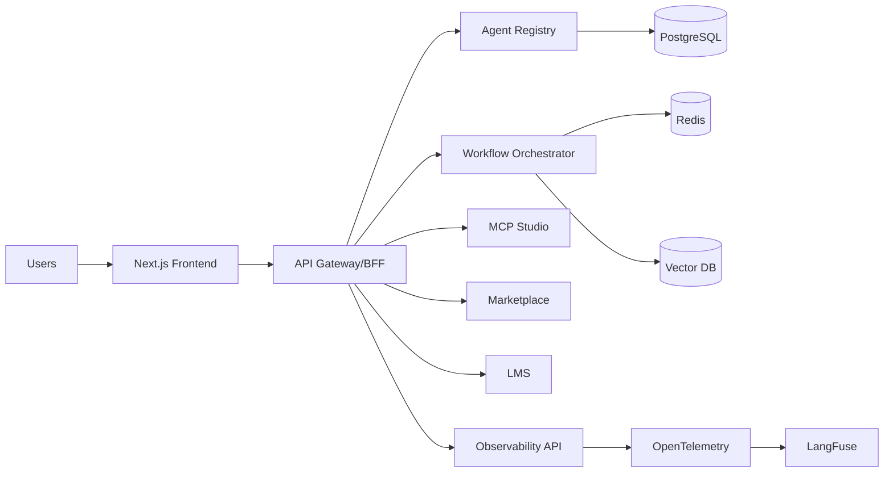
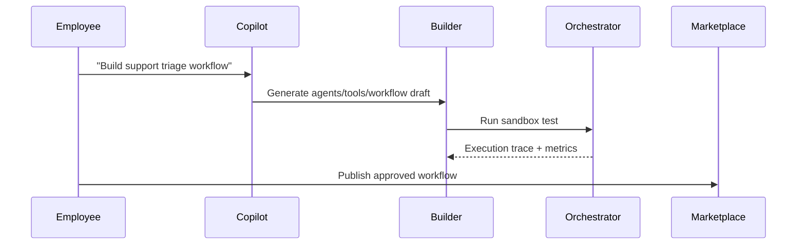

# AgentThat Foundation Blueprint

## Phase 1 — Product Requirements Document (PRD)

### Vision
Transform individual AI usage into an organizational capability by making prompts, agents, workflows, governance, and outcomes reusable and measurable.

### Personas
- **Employee Builder**: creates agents/workflows without code.
- **Team Lead**: curates shared assets and enforces approval.
- **Platform Admin**: manages governance, security, and deployment.
- **Executive**: tracks adoption, ROI, and organizational maturity.

### User Journeys
1. User describes intent in Copilot.
2. Copilot generates agent ecosystem (agents, tools, MCP, policy defaults).
3. User validates in sandbox and publishes to marketplace.
4. Team installs and customizes template.
5. Managers monitor usage, quality, and ROI dashboards.

### Functional Requirements
- Copilot-generated agent ecosystems from plain language.
- Visual no-code/low-code workflow builder.
- Multi-agent orchestration (sequential/parallel/routing/retries/human approval).
- MCP server generation from APIs/specs/docs/DBs.
- Internal marketplace with ratings, search, recommendations.
- Team collaboration with versioning, comments, and forking.
- Adoption analytics and executive exports.
- LMS with role-based learning journeys and certifications.
- OpenTelemetry-based tracing and diagnostics.
- Multi-model deployment center (SaaS/customer cloud/on-prem/hybrid).

### Non-Functional Requirements
- Multi-tenant isolation by design.
- 99.9%+ availability (higher for enterprise tiers).
- Horizontal scalability and zero-downtime deployments.
- End-to-end encryption, auditability, and governance controls.
- Configurable regional data residency.

### Success Metrics
- Adoption rate, WAU/MAU, reuse ratio, deployment frequency.
- Time-to-first-agent and time-to-production-workflow.
- ROI estimates and estimated hours saved.

---

## Phase 2 — Software Architecture Document

### System Architecture
- **Frontend (Next.js)**: builder UI, dashboards, marketplace, LMS.
- **API Gateway/BFF**: auth, tenant routing, API composition.
- **Core Services (FastAPI)**:
  - Identity & Access
  - Agent Registry
  - Workflow Orchestrator
  - MCP Studio
  - Marketplace
  - Collaboration
  - Analytics & Reporting
  - LMS
  - Deployment Manager
  - Observability Ingestion
- **Data Plane**: PostgreSQL, Redis, vector DB (Qdrant/Azure AI Search), object storage.
- **Event Bus**: domain events for usage, deployment, workflow status, learning progress.

### Security Architecture
- Entra ID SSO + SAML/OIDC/OAuth.
- RBAC + attribute-based tenant/workspace checks.
- Secrets via managed vault; scoped runtime credentials.
- Central policy engine for approvals and data controls.

### Agent Runtime Architecture
- LangGraph/PydanticAI-based runtime workers.
- Tool execution sandbox with policy guardrails.
- Memory adapters (short-term, long-term, semantic).

---

## Phase 3 — Database Design

### Core Entities
- Tenant, User, Team, Workspace
- Agent, AgentVersion, Tool, MCPServer, Workflow, WorkflowVersion
- MarketplaceListing, Install, Rating, Review
- ExecutionRun, StepRun, TokenUsage, CostRecord, AuditLog
- Course, LearningPath, Enrollment, Assessment, Certification

### Relationships
- Tenant 1:N Users/Teams/Workspaces/Assets.
- Agent 1:N AgentVersions.
- WorkflowVersion N:M Agents (via workflow steps).
- MarketplaceListing 1:N Reviews/Ratings/Installs.

### Indexing Strategy
- Composite indexes: `(tenant_id, status)`, `(tenant_id, created_at)`.
- GIN indexes for searchable metadata/tags.
- Partition large observability tables by time and tenant.

---

## Phase 4 — API Design

- REST-first APIs with OpenAPI 3.1 (`openapi/agentthat-api.yaml`).
- OAuth2/OIDC bearer auth with tenant-aware scopes.
- Idempotent deployment and publish endpoints.
- Cursor pagination for marketplace and observability feeds.

---

## Phase 5 — UX Wireframes (Text)

### Information Architecture
- Global: Home, Builder, Marketplace, Observability, LMS, Admin.

### Key Flows
1. Create with Copilot → Edit in Builder → Test → Publish.
2. Discover in Marketplace → Install → Configure → Deploy.
3. Track adoption and ROI in dashboards.

---

## Phase 6 — User Stories

### Epic: Agent Creation
- As an employee, I can describe a workflow in plain English and get a runnable draft.
- **Acceptance**: generated flow includes agents, tools, policies, and test run output.

### Epic: Governance
- As an admin, I can require approval before publishing to marketplace.
- **Acceptance**: unapproved assets cannot be installed organization-wide.

### Epic: Adoption Analytics
- As an executive, I can export monthly adoption and ROI reports.
- **Acceptance**: export supports dashboard, PDF, and PPT outlines.

---

## Phase 7 — Sprint Plan

- **Sprint 1**: Identity, tenant model, base APIs, health/diagnostics.
- **Sprint 2**: Agent registry + workflow editor + sandbox test run.
- **Sprint 3**: Marketplace + collaboration + versioning.
- **Sprint 4**: Observability + adoption analytics + LMS foundations.
- **Sprint 5**: Deployment center + enterprise hardening + scale tests.

---

## Phase 8 — Repository Structure

```
backend/        # FastAPI services
frontend/       # Next.js app (to be expanded)
infra/          # Terraform + Kubernetes
docs/           # Product and architecture documentation
openapi/        # API contracts
tests/          # Integration/e2e/load tests (future)
```

---

## Phase 9 — Production-Ready Code (Foundation)

Current repository includes a runnable backend foundation with typed FastAPI app, tenant-aware health endpoint, and tests as a safe baseline for incremental module implementation.

---

## Phase 10 — Infrastructure as Code

Terraform + Kubernetes starter included under `infra/` for Azure-ready deployment extension.

---

## Phase 11 — CI/CD Pipelines

GitHub Actions CI (`.github/workflows/ci.yml`) runs backend tests on pushes and PRs.

---

## Phase 12 — Test Suites

Initial unit/API tests provided for health endpoint and tenant header behavior; integration/e2e/load planned by module rollout.

---

## Phase 13 — Developer Documentation

This blueprint + OpenAPI + README provide initial architecture and development guidance.

---

## Phase 14 — Deployment Documentation

`infra/` manifests and Terraform files provide initial deployment baseline for managed Kubernetes deployment.

---

## Phase 15 — Architecture Diagrams (Mermaid)




